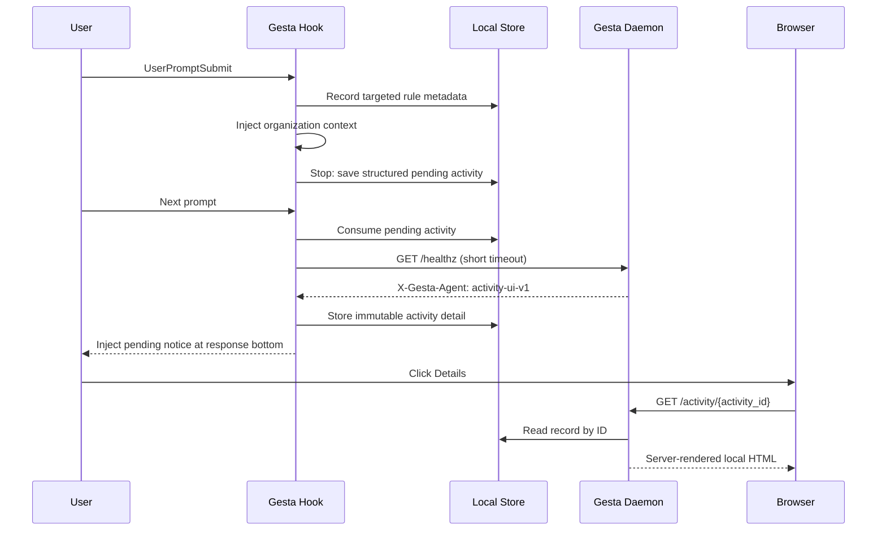

# 本地 Gesta 活动详情页设计

## 状态

第一版已确认并实现，创建于 2026-07-26。

其中“不保存和展示 Context 内容”的决策已由
[`local-activity-content-details.zh-CN.md`](./local-activity-content-details.zh-CN.md)
取代。本文保留为第一版架构记录。

## 摘要

在下一轮回答底部的 Gesta notice 中，为发生定向 Organization Context
命中的活动增加一个本地 `Details` 链接：

```text
Gesta governance · Context append: 2 · Observed output: 42 code lines · [Details](http://127.0.0.1:3333/activity/01K...)
```

点击后由本机常驻的 `gesta-agent` daemon 渲染一个只读详情页，展示：

- 本轮命中了哪些定向 Context rules；
- 每条规则的匹配类型；
- 本轮可度量产出摘要；
- Agent 类型和活动时间。

页面不展示 prompt、注入的 Context 内容、关键词、正则表达式、文件路径、
文件内容、API key 或远程身份信息。

该能力只修改 `gesta-agent`，不修改 Control、Console、服务端数据库或协议。

## 兼容性决策

沿用当前开发阶段的产品决策：不兼容旧版本地 receipt 和 pending notice
schema。

实现时直接升级本地 schema。旧 schema 读取失败后 fail open 并由现有有界清理
删除，不增加迁移代码和双写逻辑。

## 背景

当前 notice 只展示数量：

```text
Gesta governance · Context append: 2 · Observed output: 42 code lines
```

它能证明 Gesta 生效，但用户无法确认具体命中了哪些 Context rules。直接把规则名
全部追加到聊天正文会带来三个问题：

1. notice 变长并干扰正常回答；
2. 多条规则在窄屏下可读性差；
3. 后续增加匹配类型、时间和产出信息时没有稳定承载面。

因此保留一行 notice 作为轻量状态，并将详细信息放在本机页面。

## 设计目标

- notice 保持单行、低干扰；
- 用户可以查看本轮命中的定向 Context rules；
- `every prompt` 规则不计数，也不进入详情页；
- 页面只在 loopback 地址提供，不接受外部网络连接；
- 页面使用 daemon 内置 HTML，不依赖远程 JS、CSS、字体或图片；
- Hook 与 daemon 通过有界本地文件存储解耦；
- daemon 重启后，未过期详情仍可访问；
- 多个 Codex、Claude Code session 并发时互不覆盖；
- 详情读取为 O(1)，清理有单次上限；
- 本地详情能力失败时不影响 Hook、模型回答、事件上报或 daemon 主循环。

## 非目标

- 展示或存储原始 prompt；
- 展示或存储规则的 Context 内容；
- 展示匹配到的具体关键词或正则表达式；
- 在详情页修改、启停或删除规则；
- 从详情页跳转远程 Console；
- 为 `every prompt` 规则创建详情；
- 保存全部历史活动；
- 在 Control 或 Console 新增详情 API；
- 使用 API key、cookie、localStorage 或登录态；
- 支持局域网或公网访问；
- 让 Hook 自己常驻 HTTP Server。

## 产品行为

### Notice

只有定向 Context rule 命中时才增加链接：

```text
Gesta governance · Context append: 2 · [Details](http://127.0.0.1:3333/activity/01K...)
```

同时存在产出时：

```text
Gesta governance · Context append: 2 · Observed output: 42 code lines · [Details](http://127.0.0.1:3333/activity/01K...)
```

只有产出、没有定向 Context 命中时不创建详情记录，也不展示链接：

```text
Gesta governance · Observed output: 42 code lines
```

下一轮消费 pending activity 时才检查本地 UI 并创建详情。健康检查失败时不创建
详情记录，notice 降级为当前无链接格式。Hook 不等待 daemon 恢复，也不阻止用户请求。

### 页面信息层级

页面采用单列本地诊断面板，不复制 Console 的仪表盘结构：

```text
Gesta
Local activity detail                              2 context rules appended

Codex · Jul 26, 2026, 18:42:10

Applied context
┌─────────────────────────────────────────────────────────────────────┐
│ Production Operation Notice                         Keyword match   │
│ Priority 100                                                       │
├─────────────────────────────────────────────────────────────────────┤
│ Code Base Modification Standards                     Regex match   │
│ Priority 80                                                        │
└─────────────────────────────────────────────────────────────────────┘

Observed output
42 code lines · 18 test lines

Stored locally by Gesta · Expires in 24 hours
```

页面文案使用 `Applied context` 和 `Context rules`，不使用 `Policies`，避免与
Operational Policies 混淆。

### 空状态和错误状态

- 记录不存在或已过期：HTTP 404，展示 `This activity detail is no longer available.`
- ID 格式非法：HTTP 404，不区分非法和不存在；
- 非 GET/HEAD 请求：HTTP 405；
- daemon 未运行或端口不可用：浏览器显示连接失败，notice 生成阶段应尽量通过
  健康检查避免产生这种链接。

## 架构

### 进程职责

Hook 进程：

- 在 `UserPromptSubmit` 记录定向规则的最小元数据；
- 在 `Stop` 汇总 Context match 和 output；
- 写入结构化 pending activity；
- 下一轮允许的 `UserPromptSubmit` 消费 pending activity；
- 检查本地 UI 是否为 Gesta daemon；
- 健康时写入不可变 activity detail，并格式化带链接的 notice。

Daemon 进程：

- 启动 loopback HTTP Server；
- 按 activity ID 读取本地详情；
- 使用 `html/template` 服务端渲染；
- 定期执行有界清理；
- daemon 停止时优雅关闭 HTTP Server。

两者不共享内存。详情文件是 Hook 创建、daemon 读取的唯一桥梁。

### 请求流程



## 数据模型

### Turn receipt

现有 `PolicyMatchCount` 替换为定向规则最小元数据：

```go
type ContextRuleMatch struct {
    RuleID    string `json:"rule_id"`
    Name      string `json:"name"`
    MatchType string `json:"match_type"`
    Priority  int    `json:"priority"`
}

type Receipt struct {
    SchemaVersion  int                `json:"schema_version"`
    ExpiresAt      time.Time          `json:"expires_at"`
    ContextMatches []ContextRuleMatch `json:"context_matches,omitempty"`
    Output         OutputSummary      `json:"-"`
}
```

约束：

- 最多 10 条，与 matcher 的 `MaxMatchedRules` 一致；
- 忽略 `match_type == always`；
- `RuleID` 最大 128 bytes；
- `Name` 最大 160 bytes，写入前 trim；
- `MatchType` 只允许 `keyword_any` 或 `regex`；
- 不存储 Context 内容、keywords、pattern 或 prompt。

### Activity detail

```go
type ActivityDetail struct {
    SchemaVersion  int                `json:"schema_version"`
    ActivityID     string             `json:"activity_id"`
    CreatedAt      time.Time          `json:"created_at"`
    ExpiresAt      time.Time          `json:"expires_at"`
    AgentType      string             `json:"agent_type"`
    ContextMatches []ContextRuleMatch `json:"context_matches"`
    Output         OutputSummary      `json:"output"`
}
```

路径：

```text
<data_dir>/activity-details/v1/<activity_id>.json
```

`activity_id` 使用现有随机 ID 工具生成，不包含 session ID、turn ID、用户 ID 或
规则 ID。它是不可变记录的定位符，不承担鉴权语义。

约束：

- 单条记录最大 8 KiB；
- TTL 24 小时；
- 全局最多 256 条；
- 写入使用临时文件和原子 rename；
- 文件权限 `0600`，目录权限 `0700`；
- 同一 activity ID 只写一次，不覆盖；
- 详情记录创建失败时仍生成无链接 notice。

### Pending notice

pending notice 保存有界的规则最小元数据和 output 汇总，不保存最终字符串或第二份
详情。最终 notice 在下一轮消费时格式化，因此 Details 链接对应的 24 小时 TTL 从链接
实际展示时开始。

notice 最大长度从 180 runes 调整为 320 runes，给固定格式的本地 URL 留出空间。
规则数量和 output 格式保持现有语义。

## 本地 HTTP Server

### 地址

```text
127.0.0.1:3333
```

只绑定 IPv4 loopback，不绑定 `0.0.0.0`、局域网地址或 Unix socket 转发。

固定端口让 notice 可以使用稳定 URL。若端口被占用：

- daemon 记录一次 warning；
- 主采集和上报循环继续运行；
- Hook 健康检查失败并省略 Details 链接；
- 不自动选择随机端口，避免历史链接在 daemon 重启后失效。

### 路由

| Method | Path | 行为 |
| --- | --- | --- |
| `GET`, `HEAD` | `/healthz` | 返回固定 Gesta 标识，不读取活动数据 |
| `GET`, `HEAD` | `/activity/{activity_id}` | 渲染活动详情 |
| 其他 | 任意 | 404 或 405 |

`/healthz` 返回：

```text
HTTP/1.1 204 No Content
X-Gesta-Agent: activity-ui-v1
Cache-Control: no-store
```

Hook 使用 75ms 总超时调用 `127.0.0.1`，并且只有收到准确 header 才把链接写入
notice，避免端口被其他本地程序占用时生成错误链接。

### 安全响应头

所有 HTML 响应包含：

```text
Content-Security-Policy: default-src 'none'; style-src 'unsafe-inline'; base-uri 'none'; form-action 'none'; frame-ancestors 'none'
Cache-Control: no-store
X-Content-Type-Options: nosniff
Referrer-Policy: no-referrer
Cross-Origin-Resource-Policy: same-origin
```

页面：

- 不包含脚本；
- 不加载远程资源；
- 不包含表单；
- 不允许 frame 嵌入；
- 不提供任何写操作；
- 对所有动态内容使用 `html/template` 自动转义。

Host 仅允许：

- `127.0.0.1:3333`
- `localhost:3333`

其他 Host 返回 421，降低 DNS rebinding 风险。

### 生命周期

`gesta-agent run` 启动时：

1. 先创建 `Runner`；
2. 启动 local activity server goroutine；
3. 进入现有 `RunLoop`；
4. context 取消或升级重启时，给 HTTP Server 最多 1 秒优雅关闭；
5. HTTP Server 单独失败不终止 `RunLoop`。

## 性能与容量

### 写入

每个发生定向 Context 命中的 turn 最多写一个 8 KiB JSON 文件。写入为 O(1)，
不扫描历史记录。

### 读取

activity ID 直接映射到文件名，读取为 O(1)。服务端限制：

- 请求 header 最大 8 KiB；
- 单个详情文件最大 8 KiB；
- `ReadHeaderTimeout` 2 秒；
- `ReadTimeout` 3 秒；
- `WriteTimeout` 3 秒；
- `IdleTimeout` 15 秒。

页面不查询 Control，也不访问 daemon 事件队列。

### 清理

清理同时满足 TTL 和数量上限：

- 每轮最多访问 128 个目录项；
- 每轮最多删除 32 条；
- 使用持久化扫描游标，避免大量历史文件永远扫不到；
- 超过 256 条时优先删除最旧记录；
- 清理失败只记录 warning，不影响采集。

最坏磁盘预算约为：

```text
256 records × 8 KiB = 2 MiB
```

HTML 模板编译进二进制，不产生额外静态文件。

## 并发

- 每个 turn 创建独立 activity ID，不使用 `/latest`；
- 不同 session 不覆盖彼此详情；
- 详情写入完成后才生成链接；
- 页面读取不可变文件，不需要长时间持锁；
- 清理和读取发生竞争时，读取结果允许是成功或 404；
- Stop 的 receipt consume 保证同一 turn 最多生成一次 pending activity；
- pending notice 的单消费者语义保证最多生成一次详情；

## 隐私

允许保存和展示：

- 规则 ID；
- 规则名称；
- 匹配类型；
- 优先级；
- Agent 类型；
- 创建和过期时间；
- 聚合 output 数量。

禁止保存和展示：

- prompt；
- assistant response；
- Context 内容；
- keywords；
- regex pattern；
- 文件名、文件路径和文件内容；
- tool arguments；
- API key、Control token；
- email、用户名、客户或组织 ID；
- session ID 和 turn ID。

## 失败语义

| 失败 | 行为 |
| --- | --- |
| Activity 写入失败 | 保留无链接 notice |
| 健康检查超时 | 不创建详情，保留无链接 notice |
| 端口占用 | daemon 主循环继续，所有 notice 无链接 |
| 模板渲染失败 | 返回本地通用 500，不输出记录原文 |
| 记录损坏 | 返回 404，并在后续清理 |
| 记录过期 | 返回 404 |
| 清理失败 | 记录 warning，下轮重试 |
| daemon 升级重启 | 固定端口恢复后，未过期历史链接继续有效 |

## 测试计划

### Store

- 只保存 keyword/regex 规则；
- 拒绝或截断超长字段；
- 记录不可覆盖；
- ID 不含 session、turn 或 rule ID；
- TTL 过期；
- 256 条上限；
- 有界清理游标；
- 乱序目录项不会跳过游标后的过期记录；
- 创建失败不会提前淘汰有效记录；
- 并发读、写、清理；
- 损坏和超大文件 fail closed to detail、open to hook。

### Hook

- Context match 写入完整最小元数据；
- `always` 不进入详情；
- output-only notice 不带链接；
- 本地 UI 健康时 notice 带链接；
- 端口未监听时 notice 不带链接；
- 端口由非 Gesta 服务占用时 notice 不带链接；
- activity 写入失败时不阻止 Stop；
- 多 session 生成不同链接；
- notice 仍只注入一次。

### HTTP

- 只绑定 loopback；
- health header 正确；
- 已存在记录返回 200；
- HEAD 不返回 body；
- 不存在、过期、非法 ID 返回 404；
- 非 GET/HEAD 返回 405；
- 非法 Host 返回 421；
- HTML 自动转义规则名；
- CSP、no-store、nosniff 和 no-referrer header；
- 页面无外部资源和脚本。

### Runner

- Server 和 RunLoop 同生命周期；
- bind 失败不终止 RunLoop；
- context cancel 时优雅关闭；
- upgrade re-exec 前关闭 listener。

### 全量验证

在提交 PR 前运行：

```text
go test ./...
go build ./...
```

并使用本地 daemon + Codex 完成一次真实验证：

1. 触发 keyword 或 regex Context rule；
2. 完成一个有产出的 turn；
3. 下一轮看到带 `Details` 的 Gesta notice；
4. 点击链接看到正确规则和产出；
5. 确认页面源码没有 prompt、Context 内容、关键词或正则表达式。

## 实施拆分

1. 将 turn receipt 从计数升级为定向规则最小元数据；
2. 增加有界、不可变的 activity detail store；
3. Stop 保存结构化 pending activity；
4. daemon 增加 loopback HTTP Server；
5. 下一轮消费 pending activity，并在本地 UI 健康时创建详情和格式化链接；
6. 使用内置模板实现只读详情页；
7. 将清理接入 daemon 的现有周期；
8. 补充单元、并发、HTTP 和生命周期测试；
9. 更新原 notice 设计文档中“不引入 HTTP Server”的结论；
10. 本地构建并替换 agent 做端到端验证。

## Review 决策点

实现前需要确认：

1. 固定使用 `127.0.0.1:3333`；
2. 详情保留 24 小时、最多 256 条；
3. 页面只显示规则名称、匹配类型和优先级，不显示关键词、正则或 Context 内容；
4. 只有定向 Context 命中时显示 `Details`，output-only notice 不显示链接；
5. 不兼容旧本地 schema，旧数据直接 fail open 后清理。
